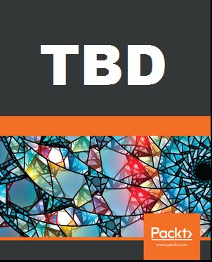

**> Chapter 3:**

# Modern Neural Networks

In Chapter 3, we caught up with years of research in machine learning, introducing ***convolutional neural networks (CNNs)***. In the following notebooks, we illustrate the operations forming the building blocks of CNNs, test a historical neural network, and experiment with modern tools to train more robust models.

## :notebook: Notebooks

(Reminder: Notebooks are better visualized with `nbviewer`: click [here](https://nbviewer.jupyter.org/github/PacktPublishing/Hands-On-Computer-Vision-with-Tensorflow/blob/master/ch3) to continue on `nbviewer.jupyter.org`.)

- 3.1 - [Discovering CNNs' Basic Operations](./ch3_nb1_discover_cnns_basic_ops.ipynb)
    - Learn to use *convolutional*, *average-pooling*, and *max-pooling* layers with TensorFlow 2.
- 3.2 - [Building and Training our First CNN with TensorFlow 2 and Keras](./ch3_nb2_build_and_train_first_cnn_with_tf2.ipynb)
    - Implement a *LeNet-5* model and test it on hand-written digit recognition.
- 3.3 - [Experimenting with Advanced Optimizers](./ch3_nb3_experiment_with_optimizers.ipynb)
    - Use and compare some of the *optimizers* offered by TensorFlow 2, to improve the training of new models.
- 3.4 - [Applying Regularization Methods to CNNs](./ch3_nb4_apply_regularization_methods_to_cnns.ipynb)
    - Avoid *over-fitting* and train more robust neural networks by applying *regularizers*, *dropout*, *batch normalization*, etc.
