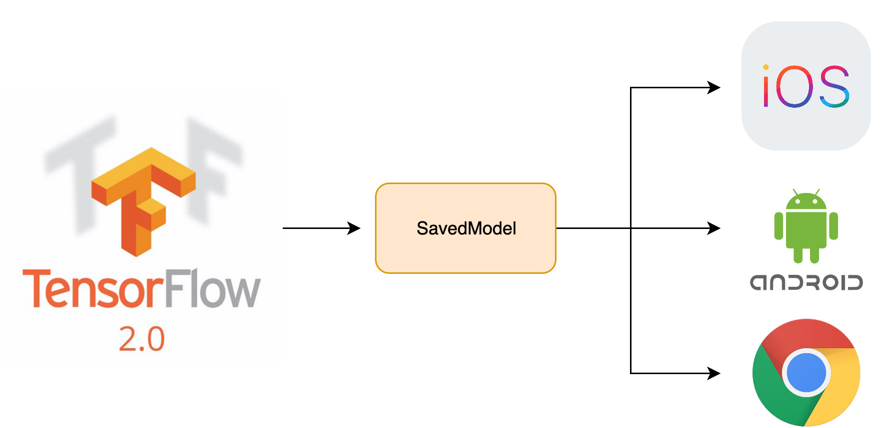

## Run TensorFlow 2 on any device

This project walks you through the process of creating an emotion recognition app on Android, iOS and in the browser:
- Load data and train model
- Export as SavedModel
- Run on Android using TensorFlow Lite
- Run on iOS using Core ML
- Run in the browser using TensorFlow.js

## Demo
A demo for the browser version is [available here](https://ndres.me/face-emotion/)

## Running in the browser
Folder: `tfjs`

Install [yarn](https://yarnpkg.com/en/) and run:

    cd tfjs
    yarn
    yarn watch
    
## Running on iOS
Folder: `coreml_ios`

You must have Xcode and [Cocoa Pods](https://cocoapods.org/) installed as well as a mac computer.

    cd coreml_ios/app
    pod install
    open Core\ ML\ Demo.xcworkspace

## Running on Android
Folder: `tf_lite_android`

[Android Studio](https://developer.android.com/studio) must be installed.
